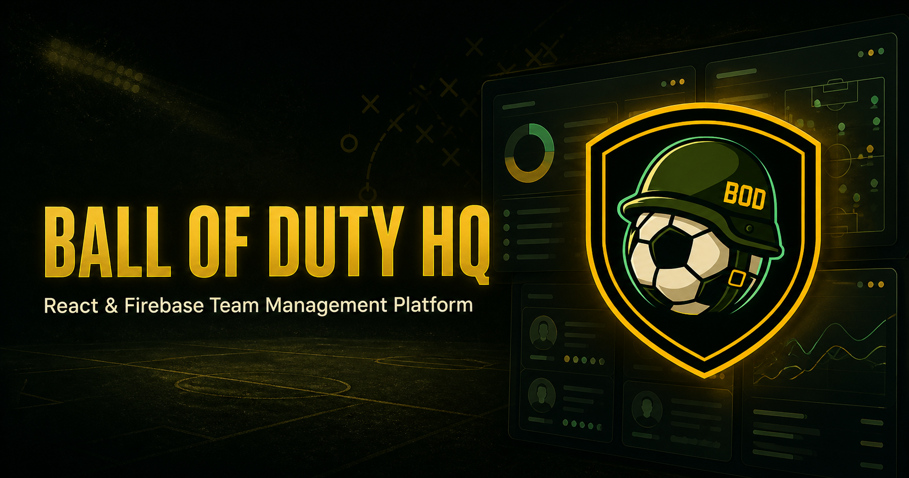

# ⚽ Ball of Duty HQ



> A React and Firebase team management platform built for the Ball of Duty competitive EA SPORTS FC club.

[](https://ball-of-duty-hq.web.app/)


Ball of Duty HQ centralizes the club's day-to-day management, competitive data, attendance workflows and internal tactical knowledge in one place.

This is not a demo or a fictional case study: it is an actively developed application designed around the real workflows of the Ball of Duty team.

## Live Application

**Production:** [ball-of-duty-hq.web.app](https://ball-of-duty-hq.web.app/)

Registration is available through email/password or Google. New accounts require administrator approval, and some sections are available only to users connected to a player profile.

## Screenshots

Product screenshots will be added here to showcase the dashboard, squad management, competitive statistics, tactics and live-stream experience.

## Key Features

### Player and squad management

- Manually maintained player profiles independent from registered user accounts
- Primary position and any number of secondary positions
- All-rounder role for versatile players
- Active/inactive squad status
- Player avatars with Cloudinary uploads
- Optional linking between a website user and a squad player

Keeping users and players separate allows the club to maintain a complete squad even when not every player registers on the platform.

### Authentication and access control

- Firebase email/password authentication
- Google sign-in
- Administrator approval for new registrations
- Pending-approval screen for unapproved accounts
- Protected routes for authenticated, approved and player-linked users
- Admin-controlled access to management functionality

### Administration

- User approval and rejection
- User-to-player profile linking
- Player, season and match management
- Configuration of live-stream and competition content
- Trusted server-side tooling for privileged Firebase Authentication operations

### Discord native poll integration

A Discord bot synchronizes the club's native Discord polls with Firebase Realtime Database.

- Multiple configured poll channels
- Training, competitive match and community poll categories
- Attendance and response tracking
- Discord user mapping
- Active and recently closed poll handling
- Automatic synchronization through a Railway worker

### Benefit Tracker

The Benefit Tracker turns poll participation into a transparent attendance overview, making it easier to see who responds consistently and who still has outstanding confirmations.

### VPG statistics integration

The application consumes Virtual Pro Gaming data to display:

- League standings
- Team and match statistics
- Player performance data
- Goals, assists, ratings and additional position-specific metrics
- Player rankings across competitions
- Normalized positional leaderboard records
- Duplicate handling when the same player appears in multiple positional lists within one VPG season

### Seasons, competitions and matches

- Season and competition records
- Match scheduling and editing
- Upcoming and completed match states
- Competition-specific data used throughout the dashboard, calendar and stream hub
- Empty states when no current match data is available

### Calendar and Matchday XI

- Club calendar for training sessions and competitive fixtures
- Matchday lineup management
- Starting XI workflows connected to the club's squad data

### Twitch live hub

- Embedded Ball of Duty Twitch stream
- Automatic live/offline indicator in the navigation
- Complete rotating league standings
- Rotating player leaderboards by metric
- Multi-league presentation for active competitions
- Admin-configurable content based on the streamed competition

### Tactical playbook

The internal tactics section is restricted to approved users with a linked player profile.

- 3-5-2
- 4-2-3-1
- 4-3-3 (False 9)
- Role descriptions and visual formation cards
- Corner-kick variations with written instructions
- Embedded Twitch clips and locally hosted tactical videos

## Tech Stack

### Frontend

- React
- React Router
- JavaScript
- HTML5 and custom CSS
- Vite

### Backend and data

- Firebase Authentication
- Firebase Realtime Database
- Firebase Hosting
- Firebase Admin SDK
- Cloudinary

### Integrations and infrastructure

- Discord.js
- Twitch API and embedded player
- Virtual Pro Gaming public APIs
- Railway

## Architecture

```text
ball-of-duty-hq/
├── public/
│   ├── assets/brand/
│   └── videos/tactics/
├── src/
│   ├── components/
│   ├── contexts/
│   ├── data/
│   ├── firebase/
│   ├── pages/
│   ├── services/
│   └── styles/
├── bot/
│   ├── scripts/
│   └── src/
├── firebase.json
├── database.rules.json
└── vite.config.js
```

### Runtime data flow

```text
Discord polls ──> Railway worker ──> Firebase Realtime Database
Twitch API    ──> Railway worker ──> Firebase Realtime Database
VPG APIs      ────────────────────> React application
Firebase Auth ───────────────────> Protected application routes
Firebase RTDB <─────────────────> React application
Cloudinary    <─────────────────> Player avatar workflow
```

The frontend and background worker are deployed independently. A frontend release does not require restarting the Discord/Twitch worker, while backend worker changes can be deployed without rebuilding Firebase Hosting.

## Data Flow Examples

### Discord polls

```text
Discord native poll → Discord bot → Firebase → Ball of Duty HQ
                                              ↓
                              Voting, attendance and Benefit Tracker data
```

### Competitive data

```text
External VPG data source → REST API → application services → React UI
                                                      ↓
                                      Player, team and match data
```

### Live broadcast

```text
Twitch stream → live-status detection → Ball of Duty HQ → embedded broadcast
                                                       └→ team and player statistics
                                                          → broadcast-style overlay
```

## Local Development

### Prerequisites

- Node.js 20 or newer
- npm
- A Firebase project
- Optional integration credentials for Discord, Twitch and Cloudinary

### 1. Clone and install

```bash
git clone https://github.com/i-am-gcs/ball-of-duty-hq.git
cd ball-of-duty-hq
npm install
```

### 2. Configure the frontend

Copy the example environment file and provide your own values:

```bash
cp .env.example .env
```

Frontend environment variables include:

```text
VITE_FIREBASE_API_KEY
VITE_FIREBASE_AUTH_DOMAIN
VITE_FIREBASE_DATABASE_URL
VITE_FIREBASE_PROJECT_ID
VITE_FIREBASE_STORAGE_BUCKET
VITE_FIREBASE_MESSAGING_SENDER_ID
VITE_FIREBASE_APP_ID
VITE_CLOUDINARY_CLOUD_NAME
VITE_CLOUDINARY_UPLOAD_PRESET
```

### 3. Start the frontend

```bash
npm run dev
```

Additional commands:

```bash
npm run build
npm run preview
```

### 4. Configure the worker

```bash
cd bot
npm install
```

Copy `bot/.env.example` to `bot/.env` and configure the required services.

Common worker variables include:

```text
DISCORD_BOT_TOKEN
DISCORD_GUILD_ID
DISCORD_POLL_CHANNELS
FIREBASE_DATABASE_URL
FIREBASE_SERVICE_ACCOUNT_BASE64
TWITCH_CLIENT_ID
TWITCH_CLIENT_SECRET
TWITCH_CHANNEL
```

Validate and start the worker:

```bash
npm run check
npm start
```

> Never commit `.env` files, bot tokens, service-account credentials or API secrets.

## Deployment

| Responsibility | Service |
| --- | --- |
| React frontend | Firebase Hosting |
| Authentication | Firebase Authentication |
| Application data | Firebase Realtime Database |
| Discord and Twitch worker | Railway |
| Player avatar media | Cloudinary |

## Security and privacy

- Authentication and administrator approval are separate checks.
- Tactical content requires an approved, player-linked account.
- Firebase database rules protect client-accessible data.
- Privileged Firebase Authentication operations are handled through trusted server-side tooling.
- Secrets are supplied through environment variables and are not stored in the repository.

## Project Status

Ball of Duty HQ is under active development and is already used for real club workflows. Features evolve alongside the team's competitive seasons, integrations and operational needs.

## Project Background

Ball of Duty HQ started as a way to replace fragmented club-management workflows with one internal platform. An active competitive team receives information from several places—Discord polls, competitive statistics, match schedules, player data and live broadcasts. The HQ brings those workflows together and continues to evolve from real team usage.

## Author

Created and maintained by **Gergő Csocsics**.

Junior full-stack developer focused on React, JavaScript, Node.js and Firebase, with a professional background in enterprise IT infrastructure and system administration.

- [LinkedIn](https://www.linkedin.com/in/iam-gergo-csocsics/)
- [GitHub](https://github.com/i-am-gcs)
